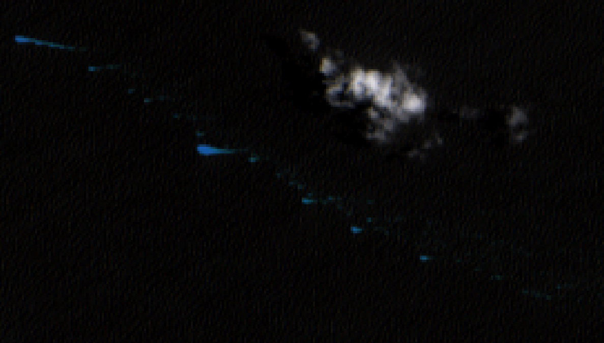
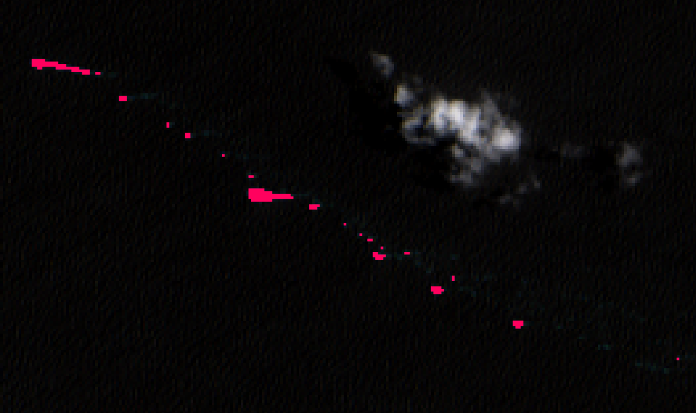

 

# LANOT_sentinel2_sargazo

 Detección automática de sargazo en el caribe mexicano, mediante imágenes Sentinel-2.

## Desarrollo
 
 Desarrollado en el Laboratorio Nacional de Observación de la Tierra LANOT e IGG UNAM.

## Descripción
 
 * Descarga automática de imágenes de la data hub Copernicus.
 * Conversión de nivel L1C a L2A, mediante el paquete sen2cor.
 * Algoritmo de búsqueda por condicional en las bandas del infrarrojo.
 * Aplicación de máscaras de tierra, nube alta con buffer para eliminar bordes y nube baja con filtro de vecindad.
 * Poligonización de los datos binarios.

## Instalación
 
 Para crear los directorios de prueba, descarga e instalación de sen2core y descarga de mascaras ejecute:
 
 `sh install.sh`

## Uso
 
 Ejecucion del proceso diariamente:
 `python3 automatico.py`
 
 Ejecucion del proceso manual:
 `python3 sargazo_manual.py`

 Ejecucion de conversion de L1C a L2A:
 `python3 sentinel_L1CtoL2A.py`
 
 ## Resultados
 
 
