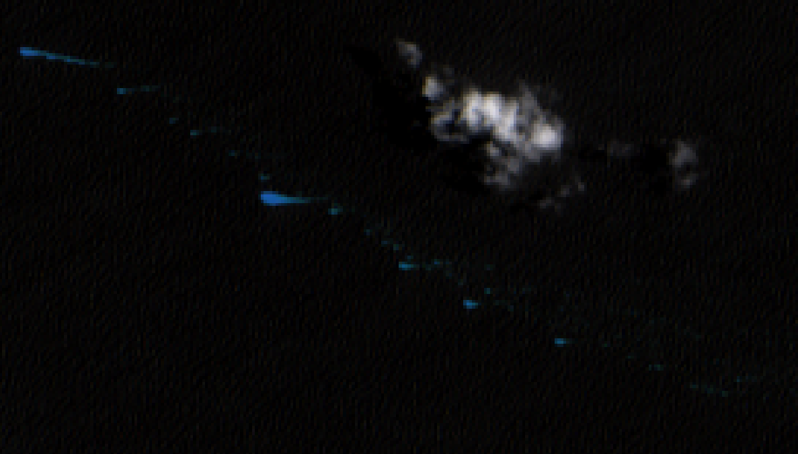
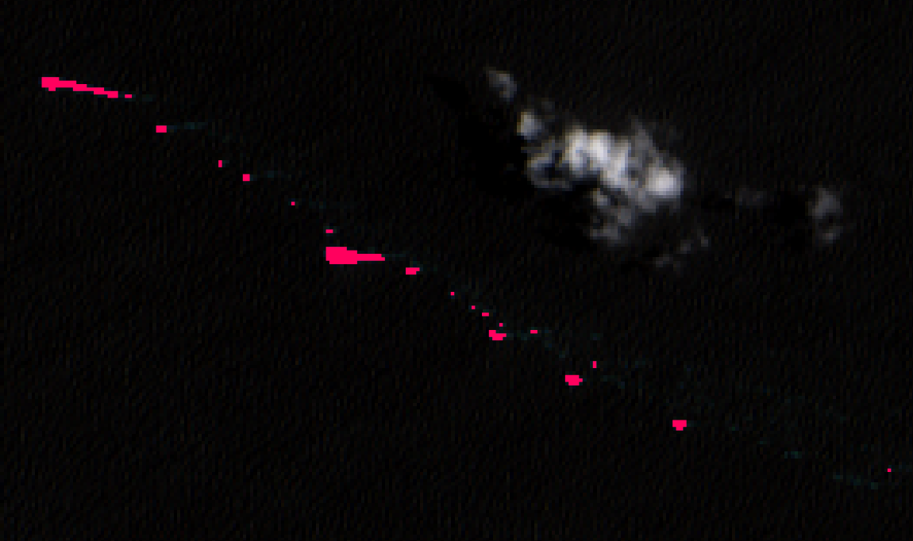

 

# LANOT_sentinel2_sargazo

 Detección automática de sargazo en el caribe mexicano, mediante imágenes Sentinel-2.

## Desarrollo
 
 Desarrollado en el Laboratorio Nacional de Observación de la Tierra LANOT e IGG UNAM.

## Descripción
 
 * Descarga automática de imágenes de la data hub Copernicus.
 * Conversión de nivel L1C a L2A, mediante el paquete sen2cor.
 * Algoritmo de búsqueda por condicional en las bandas del infrarrojo.
 * Aplicación de máscaras de tierra, nube alta con buffer para eliminar bordes y nube baja con filtro de vecindad.
 * Poligonización de los datos binarios.

## Instalación

 Crear el entorno conda con todas las dependencias:

 ```bash
 conda env create -f environment.yml
 conda activate sargazo
 ```

 Para crear los directorios de prueba, instalación de Sen2Cor y descarga de máscaras:

 `sh install.sh`

## Configuración de credenciales

 Copia el archivo de ejemplo y rellena tus credenciales:

 `cp bin/base_example.py bin/base.py`

 Edita `bin/base.py` con tus credenciales de Copernicus DataSpace, base de datos PostgreSQL y correo de notificaciones. Este archivo está en `.gitignore` y nunca se sube al repositorio.

## Uso
 
 Ejecucion del proceso diariamente:
 `python3 sargazo_automatico.py`
 
 Ejecucion del proceso manual:
 `python3 sargazo_manual.py`

 Ejecucion de conversion de L1C a L2A:
 `python3 sentinel_L1CtoL2A.py`

## Prueba local

 Para verificar el procesamiento completo en una máquina local sin necesidad de base de datos ni acceso al servidor, ejecuta el script de prueba con tile `16QDH` y fecha `2026-04-10`:

 ```bash
 cd bin/
 python3 sargazo_test.py
 ```

 El script utiliza la estructura de carpetas creada por `install.sh` (`test/` y `data/masks/`). Las operaciones de base de datos, correo y copia al servidor se omiten automáticamente. Los resultados se guardan en `test/`.
 
 ## Resultados
 
 
